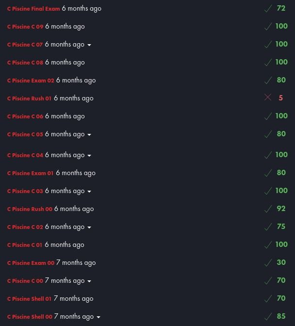

# Piscine 42 
Ce repository contient les exercices réalisés pendant la Piscine de l'école 42 en juillet 2023. L'objectif principal de cette Piscine était d'apprendre le langage C et de développer des compétences en programmation.

## Technologies Utilisées

- Langage C
- Shell (pour la navigation dans le terminal)

## Structure du Repository

Le repository est structuré en dossiers correspondant aux différents days de la Piscine. Chaque dossier contient les exercices réalisés pour ce days.

## Instructions

Si vous consultez ce repository dans le but d'apprendre, je vous encourage à utiliser ces exercices comme référence et point de départ pour vos propres explorations en programmation. Cependant, veuillez noter que copier-coller sans compréhension ne vous aidera pas à progresser.

## Note

Voici les notes que j'ai obtenue :
